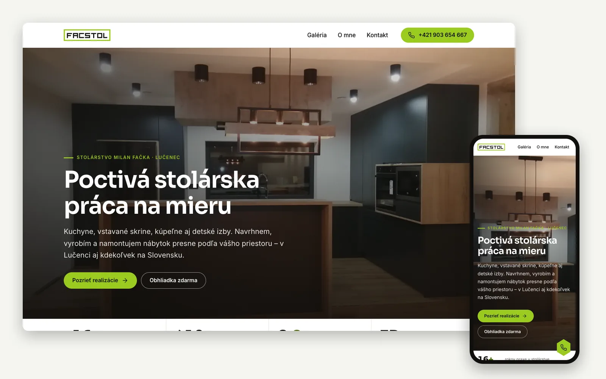
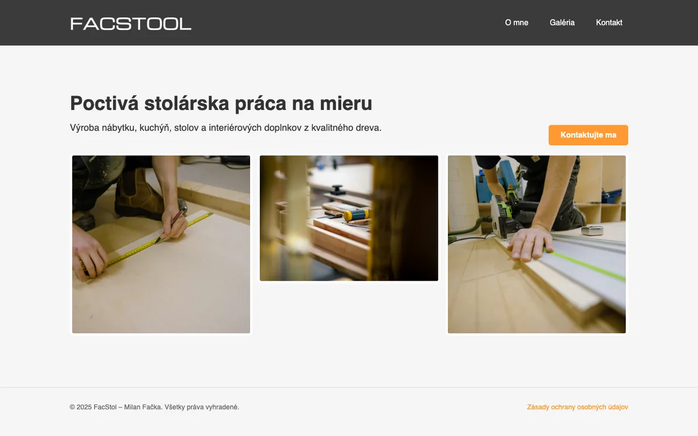
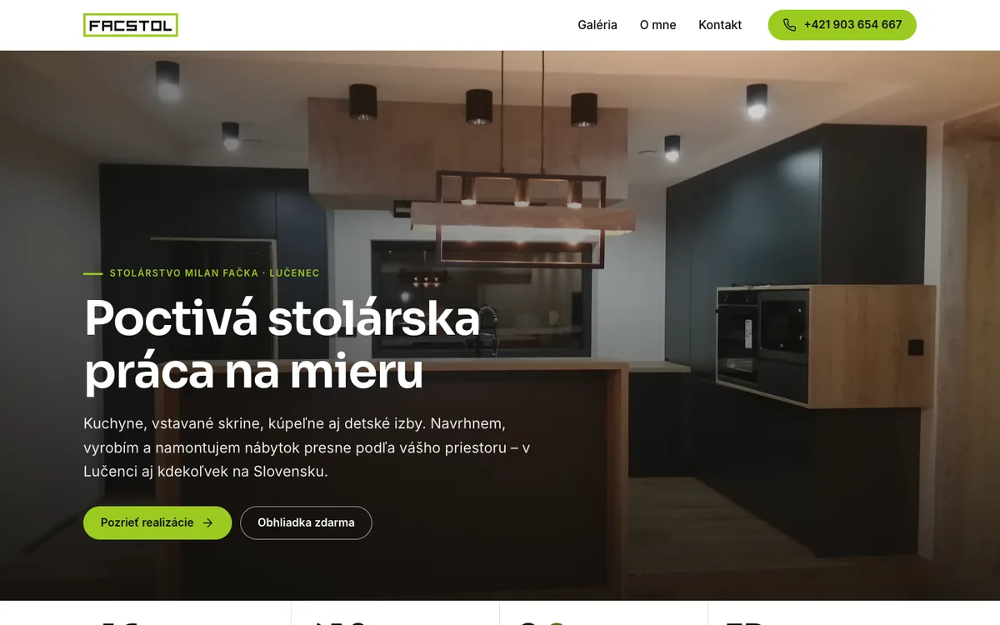
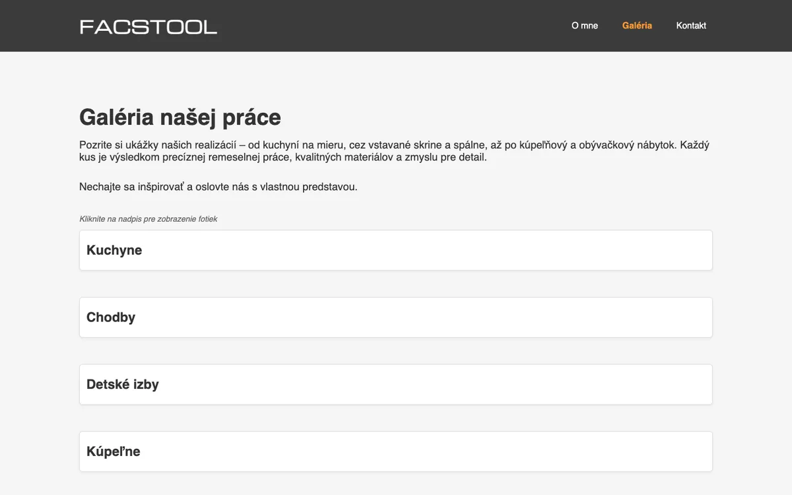
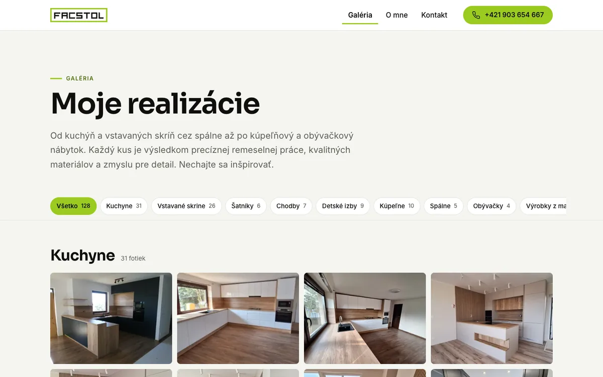
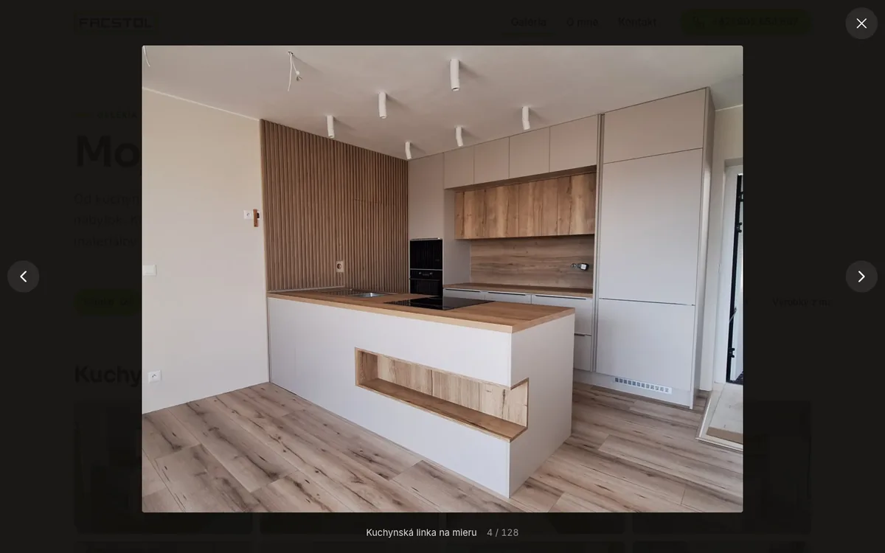
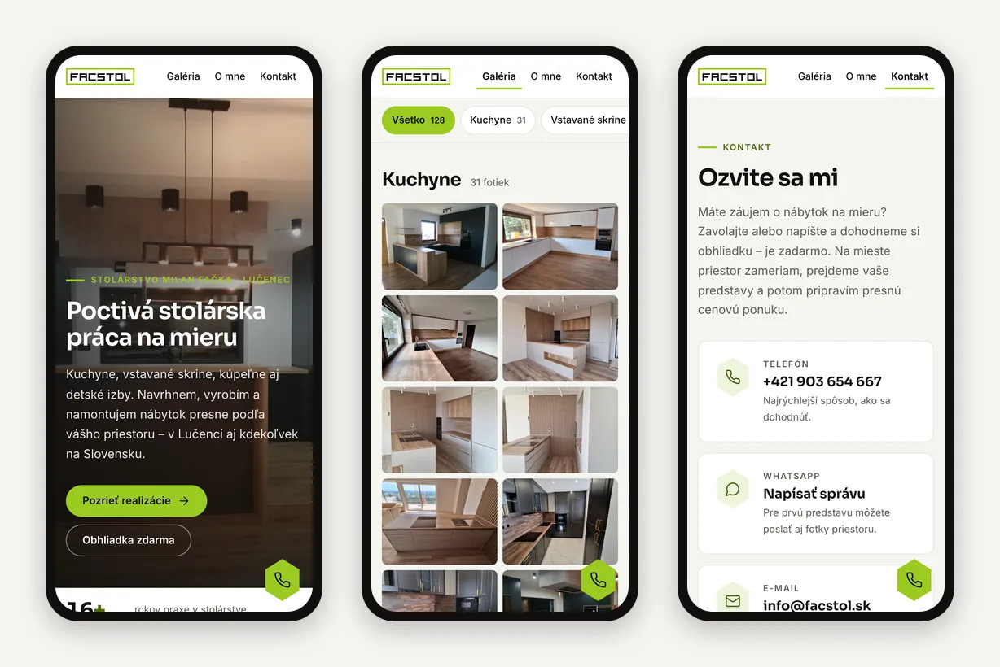
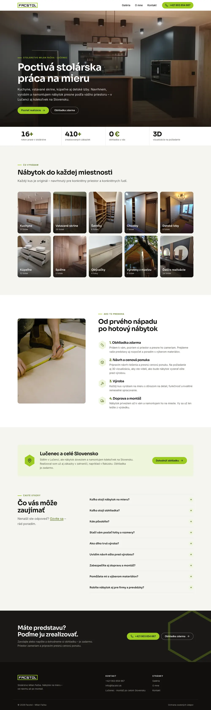

<p align="center">
  <picture>
    <source media="(prefers-color-scheme: dark)" srcset="docs/logo-dark.svg">
    
  </picture>
</p>

<p align="center">
  Website for <b>Facstol</b>, a custom furniture workshop from Lučenec, Slovakia.<br>
  Fast, static and free to host – built with Astro and deployed to GitHub Pages.
</p>

<p align="center">
  <a href="https://facstol.sk"><b>facstol.sk</b></a> ·
  <a href="#features">Features</a> ·
  <a href="#before--after">Before &amp; after</a> ·
  <a href="#tech-stack">Tech stack</a> ·
  <a href="#getting-started">Getting started</a>
</p>



## About

Facstol is a small carpentry business run by Milan Fačka – kitchens, built-in wardrobes, bathrooms,
children's rooms and solid-wood furniture, made to measure and installed anywhere in Slovakia.

The first version of this site was one of my first web projects: five hand-written HTML pages that served
the original 4 MB photos straight from the repository. This is a complete rebuild – a new brand
(the business was renamed from *Facstool* to *Facstol*), a design based on the company logo, a proper
image pipeline, SEO and a much better experience on phones – while still hosting for free on GitHub Pages.

## Before & after

| Before | After |
| --- | --- |
|  |  |
|  |  |

|  | Before | After |
| --- | --- | --- |
| Codebase | 5 HTML files with copy-pasted header and footer | Astro components, data-driven pages |
| Photos | originals served as-is (up to 4.6 MB each) | responsive WebP generated at build time |
| Homepage weight | > 5 MB | ≈ 0.7 MB¹ |
| Kitchen gallery (31 photos) | 64 MB | ≈ 0.3 MB of thumbnails¹ |
| Deployed site | 240 MB | 32 MB (every image size included) |
| Adding a photo | edit HTML by hand | drop the file into a folder |
| SEO | none | meta tags, Open Graph, JSON-LD, sitemap |
| Mobile | stacked menu, no lightbox | mobile-first layout, swipeable lightbox, call button |

<sub>¹ Transferred size measured in a 1366 px wide browser window. High-DPI screens load larger image variants.</sub>

## Features

- **Image pipeline** – every photo is converted at build time into three WebP thumbnail sizes plus a
  1920 px version for the lightbox. Browsers pick the right size via `srcset`; the originals are never shipped.
- **Folder-driven gallery** – one folder = one category. A new photo appears on the site just by adding the
  file; a folder without a matching category fails the build with a clear message instead of silently disappearing.
- **Gallery UX** – category filters with shareable deep links (`/galeria/#kuchyne`), a lightbox built on the
  native `<dialog>` with keyboard and swipe navigation, preloading of neighbouring photos and focus restoration.
- **Contact form without a backend** – sends via [Web3Forms](https://web3forms.com), validates on the client,
  has a honeypot against spam and falls back to a pre-filled e-mail when no API key is configured.
- **Motion** – crossfading hero photos, scroll reveals, count-up statistics, cross-document View Transitions
  and smooth wheel scrolling with [Lenis](https://lenis.darkroom.engineering). All of it is turned off for
  users who prefer reduced motion.
- **SEO and sharing** – page titles and descriptions, canonical URLs, an Open Graph image generated at build
  time, `LocalBusiness` structured data (location and service area) and a sitemap.
- **Privacy** – no cookies, no analytics, fonts self-hosted via Fontsource, so no requests go to third parties.
- **Self-updating numbers** – years of practice and completed jobs are calculated at build time, and a
  scheduled workflow rebuilds the site every January so the numbers stay current (it can also be run by hand).
- **Accessibility** – semantic HTML, skip link, visible focus styles, alt texts and AA contrast for the
  brand green (dark text on green, a darker green for links).
- **Brand** – the logo was extracted from the original Illustrator PDF into inline SVG; the hexagon from the
  logo is reused across the UI (icons, FAQ toggles, the floating call button).
- **Lightweight** – no UI framework at runtime; 6–8 KB of gzipped JavaScript per page.

## Screenshots





<details>
<summary>Full homepage</summary>



</details>

## Tech stack

- [Astro 7](https://astro.build) – static site generation, components, image optimization (`astro:assets` + sharp)
- TypeScript – type-checked with `astro check` on every build
- Plain CSS – custom properties, no CSS framework
- [Lenis](https://lenis.darkroom.engineering) – smooth scrolling
- [Fontsource](https://fontsource.org) – self-hosted Sora and Inter variable fonts
- GitHub Actions + GitHub Pages – build and hosting
- [Web3Forms](https://web3forms.com) – contact form delivery

## Project structure

```text
src/
├── assets/
│   ├── galeria/          # photos – one folder per gallery category
│   └── dielna/           # workshop photos
├── components/           # Header, Footer, Logo, ContactForm, ThumbGrid, …
├── data/                 # gallery categories, FAQ, process steps
├── layouts/BaseLayout    # shared shell: SEO, structured data, animations
├── pages/                # one file per URL
├── styles/global.css     # design tokens and shared styles
└── config.ts             # business details in one place
docs/                     # README images
public/                   # favicon, robots.txt, CNAME
```

## Getting started

Requires Node.js 22.12 or newer.

```bash
npm install
npm run dev       # dev server on http://localhost:4321
npm run build     # type check + production build into dist/
npm run preview   # preview the production build
```

## Deployment

Every push to `main` builds the site and deploys it to GitHub Pages via
[`.github/workflows/deploy.yml`](.github/workflows/deploy.yml). The workflow also runs every January
to refresh the calculated numbers. GitHub pauses scheduled workflows in repositories without activity for
60 days, so it can also be started manually from the **Actions** tab.

## Credits

Designed and built by [Samuel Fačka](https://github.com/faco1228).

## License

The **source code** is released under the [MIT License](LICENSE).

The license does **not** cover the content of the website:

- photos in `src/assets/`,
- the Facstol name and logo – `logo/`, `docs/logo-*.svg`, the logo artwork in `src/components/Logo.astro`,
  `public/favicon.svg` and `public/apple-touch-icon.png`,
- screenshots in `docs/screenshots/`,
- the website texts.

These are © Facstol – Milan Fačka. All rights reserved; please don't reuse them without permission.
